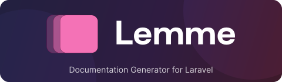

<p align="center">
    <picture>
        <source media="(prefers-color-scheme: dark)" srcset="art/lemme-art.svg">
        
    </picture>
</p>

# Lemme - Documentation Generator for Laravel

Lemme is a Laravel package that facilitates the creation of beautiful documentation websites from Markdown files. It provides a simple way to turn your project's documentation into a fully-featured website with a modern, responsive design. All from within your Laravel application.

[](https://packagist.org/packages/usesorane/lemme)

## Table of Contents

- [Quick Start](#quick-start)
- [Features](#features)
- [Installation](#installation)
- [Configuration](#configuration)
    - [Logo Customization](#logo-customization)
- [Usage](#usage)
    - [Creating Documentation](#creating-documentation)
        - [Slug Configuration](#slug-configuration)
            - [Index Pages & Nested Index Behavior](#index-pages--nested-index-behavior)
            - [Duplicate Slug Handling](#duplicate-slug-handling)
            - [Quick Reference Summary](#quick-reference-summary)
    - [Directory-based Navigation Grouping](#directory-based-navigation-grouping)
    - [Accessing Documentation](#accessing-documentation)
    - [API Access (Optional)](#api-access-optional)
    - [Commands](#commands)
    - [Publishing Assets / Views / Config](#publishing-assets--views--config)
    - [Cache & Reindex Details](#cache--reindex-details)
    - [Heading Anchors](#heading-anchors)
    - [Search Index](#search-index)
    - [Troubleshooting Slugs](#troubleshooting-slugs)
    - [Using the Facade](#using-the-facade)
- [Themes](#themes)
- [Performance](#performance)
- [Subdomain Setup (Optional)](#subdomain-setup-optional)
- [Development](#development)
    - [Building Assets](#building-assets)
- [Contributing](#contributing)
- [License](#license)
- [Credits](#credits)

## Quick Start
Lemme makes it super easy to create and maintain documentation for your Laravel projects.

Just run `php artisan lemme:install`, write your docs in the `docs/` folder and your documentation site is ready!

It's really that simple. And totally free.

## Features

- **Markdown-based**: Write your documentation in simple Markdown files inside the `docs/` directory in your project
- **Beautiful UI**: Modern design (Tailwind CSS 4 + dark mode) out of the box
- **Responsive**: Works on all devices
- **Fast**: Built-in caching (pages, HTML, search) with rotation
- **Flexible routing**: Serve via route prefix (default) or a subdomain
- **Configurable**: Directories, navigation sorting/grouping, logo rendering, search limits
- **Laravel-native**: Service provider, facade, Livewire component
- **Syntax highlighting**: Shiki-driven code highlighting (light & dark themes)
- **Directory grouping**: Automatic navigation tree from folder structure
- **Search-ready**: Plain‑text index built from rendered Markdown
- **Anchors**: Stable heading IDs with automatic de‑duplication

> Note: The `theme` config key is currently a placeholder (only the bundled default + dark mode variant ships). Extra named themes are not yet implemented.

## Installation

Install the package via Composer:

```bash
composer require usesorane/lemme
```

Install the documentation system:

```bash
php artisan lemme:install
```

This will:
- Create a `docs` directory in your project root
- Generate sample documentation files with **numbered structure**
- Publish the compiled Tailwind CSS assets
- Set up the necessary configuration

**Example navigation structure (illustrative):**
```
docs/
├── index.md
├── 1_getting-started/
│   ├── 1_installation.md
│   ├── 2_configuration.md
│   └── 3_first-steps.md
├── 2_api/
│   ├── 1_authentication.md
│   ├── 2_endpoints.md
│   └── 3_advanced/
│       ├── 1_webhooks.md
│       └── 2_rate-limiting.md
└── 3_guides/
    ├── 1_deployment.md
    └── 2_troubleshooting.md
```

**What the installer actually creates:**

```
docs/
├── index.md
└── 1_welcome/
    ├── 1_getting-started.md
    └── 2_organizing-content.md
```

Add further folders/files manually following the same naming conventions.

## Configuration

Use the environment variables or edit `config/lemme.php` to customize your documentation website:

```php
return [
    /*
    |--------------------------------------------------------------------------
    | Documentation Directory
    |--------------------------------------------------------------------------
    |
    | This is the directory where your markdown documentation files are stored.
    | By default, it's 'docs' but you can change it to any directory you prefer.
    |
    */
    'docs_directory' => env('LEMME_DOCS_DIRECTORY', 'docs'),

    /*
    |--------------------------------------------------------------------------
    | Subdomain
    |--------------------------------------------------------------------------
    |
    | The subdomain where your documentation will be served.
    | Leave as null to use route prefix instead (e.g., yoursite.com/docs).
    |
    */
    'subdomain' => env('LEMME_SUBDOMAIN', null),

    /*
    |--------------------------------------------------------------------------
    | Route Prefix
    |--------------------------------------------------------------------------
    |
    | The route prefix where your documentation will be served.
    | By default, it's 'docs' (e.g., yoursite.com/docs).
    | Set to null to use subdomain routing instead.
    |
    */
    'route_prefix' => env('LEMME_ROUTE_PREFIX', 'docs'),

    /*
    |--------------------------------------------------------------------------
    | Theme
    |--------------------------------------------------------------------------
    |
    | Placeholder for future theme variants. (Currently only the bundled
    | default style + dark mode toggle is provided.)
    |
    */
    'theme' => env('LEMME_THEME', 'default'),

    /*
    |--------------------------------------------------------------------------
    | Site Title
    |--------------------------------------------------------------------------
    |
    | The title of your documentation site.
    |
    */
    'site_title' => env('LEMME_SITE_TITLE', 'Documentation'),

    /*
    |--------------------------------------------------------------------------
    | Site Description
    |--------------------------------------------------------------------------
    |
    | A brief description of your documentation site.
    |
    */
    'site_description' => env('LEMME_SITE_DESCRIPTION', 'Project Documentation'),

    /*
    |--------------------------------------------------------------------------
    | Navigation
    |--------------------------------------------------------------------------
    |
    | Configure how navigation is generated from your markdown files.
    |
    */
    'navigation' => [
        'auto_generate' => true,
        'sort_by' => 'filename', // 'filename', 'title', 'created_at', 'modified_at'
        'sort_direction' => 'asc',

        // Directory-based grouping
        'grouping' => [
            'enabled' => true,
            'sort_groups_by' => 'directory_name', // 'directory_name', 'title'
            'sort_groups_direction' => 'asc',
        ],
    ],

    /*
    |--------------------------------------------------------------------------
    | Cache
    |--------------------------------------------------------------------------
    |
    | Enable caching for better performance in production.
    |
    */
    'cache' => [
        'enabled' => env('LEMME_CACHE_ENABLED', true),
        'ttl' => env('LEMME_CACHE_TTL', 3600), // 1 hour
    ],

    /*
    |--------------------------------------------------------------------------
    | Search
    |--------------------------------------------------------------------------
    |
    | Configure search functionality settings.
    |
    */
    'search' => [
        'max_content_length' => env('LEMME_SEARCH_MAX_CONTENT_LENGTH', 0), // 0 = no limit (index full content)
    ],

    /*
    |--------------------------------------------------------------------------
    | API Endpoints
    |--------------------------------------------------------------------------
    |
    | Optional JSON API exposing documentation structure & page data.
    | Disabled by default; enable via env when you need headless access.
    |
    */
    'api' => [
        'enabled' => env('LEMME_API_ENABLED', false),
    ],

    /*
    |--------------------------------------------------------------------------
    | Logo
    |--------------------------------------------------------------------------
    |
    | Configure how the logo in the documentation layout is rendered.
    | Supported types:
    | - view  : renders a Blade view (default existing partial)
    | - image : renders an  tag (provide image path relative to public/ or full URL)
    | - text  : renders plain text inside a <span>
    |
    | You can override via env vars, e.g.:
    |   LEMME_LOGO_TYPE=image
    |   LEMME_LOGO_IMAGE="images/logo.svg"
    |   LEMME_LOGO_ALT="My Project"
    |
    */
    'logo' => [
        'type' => env('LEMME_LOGO_TYPE', 'view'),
        'view' => env('LEMME_LOGO_VIEW', 'lemme::partials.logo'),
        'component' => env('LEMME_LOGO_COMPONENT', null),
        'image' => env('LEMME_LOGO_IMAGE', null),
        'text' => env('LEMME_LOGO_TEXT', null),
        'alt' => env('LEMME_LOGO_ALT', 'Logo'),
        // Additional CSS classes applied to the root element of image/text variants
        'classes' => env('LEMME_LOGO_CLASSES', 'h-6 text-black dark:text-white'),
    ],
];
```

### Logo Customization

You can fully customize the logo displayed in the header. Choose one of four rendering modes via the config file or environment variables.

> Recommended: Use the `component` (Blade component) or `view` (Blade partial) option. These are the most flexible and future‑proof approaches because you can:
> - Swap light/dark variants conditionally
> - Add accessible markup (ARIA labels, screen-reader text)
> - Inject dynamic data (app version, beta badge, etc.)
> - Reuse shared components / Tailwind classes
> - Evolve the logo without changing `.env` variables
>
> The `image` and `text` modes are intentionally lightweight shortcuts, but most projects should create and use a Blade component or partial.

| Type      | Env Setting                      | Required Extra Vars                    | Description                              |
|-----------|----------------------------------|----------------------------------------|------------------------------------------|
| component | `LEMME_LOGO_TYPE=component`      | `LEMME_LOGO_COMPONENT` (component name)| Renders a Blade component                |
| view      | `LEMME_LOGO_TYPE=view`           | `LEMME_LOGO_VIEW` (optional)           | Renders a Blade view (default partial)  |
| image     | `LEMME_LOGO_TYPE=image`          | `LEMME_LOGO_IMAGE` (path or URL)       | Outputs an `` tag                   |
| text      | `LEMME_LOGO_TYPE=text`           | `LEMME_LOGO_TEXT` (string)             | Simple text logo                         |

Common optional variables:

```
LEMME_LOGO_ALT="My Project"            # Alt text for image variant
LEMME_LOGO_CLASSES="h-6 w-auto"        # Extra classes applied to root element
```

Examples:

Blade component logo:
```
LEMME_LOGO_TYPE=component
LEMME_LOGO_COMPONENT=branding.logo
```

Image logo:
```
LEMME_LOGO_TYPE=image
LEMME_LOGO_IMAGE=images/logo.svg
LEMME_LOGO_ALT="Acme Docs"
LEMME_LOGO_CLASSES="h-8 w-auto"
```

Text logo:
```
LEMME_LOGO_TYPE=text
LEMME_LOGO_TEXT="Acme Docs"
LEMME_LOGO_CLASSES="text-lg font-bold"
```

Custom view (via your own Blade partial):
```
LEMME_LOGO_TYPE=view
LEMME_LOGO_VIEW=branding.logo
```

If a required variable for the chosen type is missing (or the view can't be resolved), Lemme gracefully falls back to the default bundled SVG logo.

## Usage

### Creating Documentation

1. **Create Markdown files** in your configured docs directory (default: `docs/`)
2. **Add frontmatter** to set page metadata (optional):

```markdown
---
title: Getting Started
description: Learn how to get started with our project
slug: custom-getting-started
---

# Getting Started

Your content here...
```

#### Slug Configuration

Slugs determine the URL path for your documentation pages:

- **Custom slugs**: Set a custom `slug` in the frontmatter to override the default
- **Auto-generated slugs**: When no slug is provided, Lemme automatically generates one from the filename:
  - Converts to `kebab-case` format
  - Removes number prefixes (e.g., `1_`, `2-`, `10_`)
  - Excludes directory names (only uses the filename)

All URL examples below assume the default route prefix (`/docs`). Adjust paths if you change or remove the prefix.

**Examples:**
```
 docs/1_getting-started/2_installation.md
 ├─ Default slug: "installation"
├─ URL: /installation

 docs/api/3-authentication.md  
├─ Default slug: "authentication"
├─ URL: /authentication

 docs/guides/advanced-features.md
├─ Default slug: "advanced-features"  
├─ URL: /advanced-features
```

**Custom slug example:**
```markdown
---
title: Installation Guide
slug: setup
---
```
Result: `/setup` instead of `/installation`

##### Index Pages & Nested Index Behavior

Special handling applies to `index.md` files:

- Root `docs/index.md` becomes the "home" page and gets an empty slug (served at the docs root).
- A nested `index.md` (e.g. `docs/guide/index.md`) adopts the **directory name** (`guide`) as its slug instead of `index`.
- Number prefixes on the directory (e.g. `1_guide/index.md`) are stripped before generating the slug: `1_guide/index.md` -> `guide`.
- Regular files still derive their slug from their own filename only (directories are never prefixed onto slugs except for the nested index rule above).

This keeps URLs short and predictable: `docs/guide/index.md` -> `/docs/guide`, `docs/guide/intro.md` -> `/docs/intro` (note: prefix included). Only root `index.md` is served at `/docs` itself.

##### Duplicate Slug Handling

If two files would produce the same slug (e.g. `docs/one/foo.md` and `docs/two/foo.md`) Lemme throws a runtime exception during page collection. Fix by either:

1. Adding a unique `slug:` value in one file's frontmatter, or
2. Renaming one of the files.

Fail‑fast detection prevents silently colliding pages and unexpected content swaps.

##### Quick Reference Summary

| Case | Example Path | Generated Slug | Example URL (default prefix) |
|------|--------------|----------------|------------------------------|
| Root index | `docs/index.md` | `` (empty) | `/docs` |
| Nested index | `docs/guide/index.md` | `guide` | `/docs/guide` |
| Numbered nested index | `docs/1_guide/index.md` | `guide` | `/docs/guide` |
| Regular file | `docs/guide/intro.md` | `intro` | `/docs/intro` |
| CamelCase filename | `docs/CamelCaseFile.md` | `camel-case-file` | `/docs/camel-case-file` |
| With frontmatter slug | `slug: custom` | `custom` | `/docs/custom` |
| Collision (two foo.md) | `one/foo.md`, `two/foo.md` | Error | – |

---

3. **Organize in folders** for better structure:

```
docs/
├── index.md
├── getting-started/
│   ├── installation.md
│   └── configuration.md
├── guides/
│   ├── deployment.md
│   └── troubleshooting.md
└── api/
    ├── authentication.md
    └── endpoints.md
```

### Directory-based Navigation Grouping

Lemme automatically organizes your navigation based on your directory structure. Each folder becomes a group in the sidebar navigation:

- **Root files** (like `index.md`) appear ungrouped at the top
- **Folder-based files** are grouped under collapsible sections
- **Nested folders** create sub-groups for better organization

**Example Structure:**
```
docs/
├── index.md                    # Ungrouped: "Home"  
├── 1_getting-started/          # Group: "Getting Started" (sorted first)
│   ├── 1_installation.md       #   ├─ Installation
│   └── 2_configuration.md      #   └─ Configuration
└── 2_api/                      # Group: "API" (sorted second)
    ├── 1_authentication.md     #   ├─ Authentication
    ├── 2_endpoints.md          #   ├─ Endpoints  
    └── 3_advanced/             #   └─ Advanced (sub-group)
        ├── 1_webhooks.md       #       ├─ Webhooks
        └── 2_rate-limiting.md  #       └─ Rate Limiting
```

**Number Prefixes for Sorting:**
- Use `1_`, `2_`, `10_` or `1-`, `2-`, `10-` prefixes for precise ordering
- Number prefixes are automatically removed from navigation titles
- Both `snake_case` and `kebab-case` naming conventions are supported
- Files and directories without numbers sort alphabetically after numbered ones

You can disable grouping in the configuration if you prefer a flat navigation structure.

### Accessing Documentation

By default, your documentation will be available at:

- **Route prefix (default)**: `https://yoursite.com/docs`
- **Subdomain**: `https://docs.yoursite.com` (set `route_prefix=null` and `subdomain=docs`)

Precedence: If both `subdomain` and `route_prefix` are set, the route prefix wins (a notice is logged) and subdomain routing is ignored.

### API Access (Optional)

Lemme can expose JSON API endpoints for headless usage. These are **disabled by default**. Enable them explicitly via your `.env` or config:

```
LEMME_API_ENABLED=true
```

Or set `config(['lemme.api.enabled' => true])` at runtime (e.g. inside a feature flag). Paths depend on your routing mode:

| Mode | Index Endpoint | Page Endpoint |
|------|----------------|---------------|
| Route prefix (`docs`) | `/docs/api` | `/docs/api/{slug}` |
| Custom prefix (`handbook`) | `/handbook/api` | `/handbook/api/{slug}` |
| Subdomain (`docs.`) | `https://docs.yoursite.com/api` | `https://docs.yoursite.com/api/{slug}` |

If disabled, hitting the endpoints returns 404 and named routes `lemme.api` / `lemme.api.page` are not registered.

**Example use cases when enabled:**
- Build custom documentation frontends
- Create mobile apps or SPAs
- Integrate with external tools or chatbots
- Generate documentation reports

### Commands

| Command | Purpose |
|---------|---------|
| `php artisan lemme:install` | Create docs directory + sample files; publish assets (forced) |
| `php artisan lemme:install --force` | Overwrite existing sample files if present |
| `php artisan lemme:clear` | Clear page, HTML and search caches |
| `php artisan lemme:reindex` | Rebuild page list & search; warm HTML (when cache enabled) |
| `php artisan lemme:reindex --clear` | Clear caches first, then rebuild and warm |
| `php artisan lemme:publish` | (Provided by package) Publish assets/views/config (interactive) |

Reindex is deploy‑safe; schedule it if you bulk update docs.

### Publishing Assets / Views / Config

Publish only what you need:

```
php artisan vendor:publish --tag=lemme-config
php artisan vendor:publish --tag=lemme-views
php artisan vendor:publish --tag=lemme-assets
```

Force re‑publish (e.g. after updating the package):

```
php artisan lemme:publish --force
```

### Cache & Reindex Details

Caching (when `lemme.cache.enabled=true`):

- Pages collection stored once under `lemme.pages` when first loaded.
- Each rendered HTML page cached under `lemme.html.{slug}.{modified_at}` (immutable snapshot).
- Pointer key `lemme.html.current.{slug}` tracks the active snapshot; previous snapshot key is removed on rotation.
- Search data cached under `lemme.search_data` (rebuilt with pages or on demand if missing).

Running `lemme:reindex` (without `--clear`) re-reads markdown and warms (builds) HTML only if caching is enabled. Unchanged HTML snapshots remain current; changed files receive new keys and prior snapshots are pruned.

### Heading Anchors

All Markdown headings (`#` .. `######`) are assigned stable, URL‑friendly IDs after HTML rendering. Duplicate headings on the same page receive numeric suffixes (`overview`, `overview-2`, `overview-3`, ...). This enables reliable deep‑linking and on‑page navigation.

### Search Index

The search index stores:

- `title`
- `category` (top‑level directory or `General`)
- `url`
- `content` (plain‑text extraction of rendered Markdown)

You can optionally truncate indexed content via `lemme.search.max_content_length` (0 = unlimited). Example in `.env`:

```
LEMME_SEARCH_MAX_CONTENT_LENGTH=8000
```

### Troubleshooting Slugs

- Unexpected empty slug? Likely the root `index.md`.
- Got an exception about a duplicate slug? Provide a custom frontmatter slug or rename the file.
- Want to keep nested `index.md` as `index`? Add `slug: index` to its frontmatter (be sure it won’t collide with another page).

### Using the Facade

You can also interact with Lemme programmatically:

```php
use Sorane\Lemme\Facades\Lemme;

// Get all documentation pages
$pages = Lemme::getPages();

// Get a specific page
$page = Lemme::getPage('getting-started');

// Get navigation structure
$navigation = Lemme::getNavigation();

// Clear cache
Lemme::clearCache();
```

## Themes

Lemme comes with a beautiful default theme built with Tailwind CSS 4. The theme features:

- Clean, modern design
- Responsive layout
- Mobile-friendly navigation
- Syntax highlighting for code blocks
- Automatic page navigation
- Search-friendly structure

The syntax highlighting is powered by **Shiki** and supports:

- PHP, JavaScript, Python, Ruby, Go, Rust
- HTML, CSS, SCSS, JSON, YAML, XML  
- Bash, SQL, Docker, and many more!

Simply use triple backticks with the language identifier:

````markdown
```php
<?php echo "Hello, World!"; ?>
```
````

## Performance

Lemme includes built-in caching to ensure your documentation loads quickly:

- Pages are cached automatically
- Cache respects file modification times
- Easy cache clearing via command or facade
- Configurable cache TTL

## Subdomain Setup (Optional)

By default, Lemme serves documentation at `/docs` on your main domain. To use subdomain routing instead (e.g., `docs.yoursite.com`):

1. **Configure DNS**: Add a CNAME record pointing `docs` to your main domain
2. **Set up web server**: Configure your web server to handle the subdomain
3. **Update config**: Set `LEMME_SUBDOMAIN=docs` and `LEMME_ROUTE_PREFIX=null` in your `.env` file

For Apache, add to your virtual host:
```apache
ServerAlias docs.yoursite.com
```

For Nginx:
```nginx
server_name yoursite.com docs.yoursite.com;
```

## Development

If you're contributing to Lemme or want to customize the styles:

### Building Assets

```bash
# Install dependencies
bun install

# Build for development (with watching)
bun run dev

# Build for production
bun run build
```

The compiled CSS will be generated in the `dist/` directory and can be published to Laravel projects.

## Contributing

Contributions are welcome! Please feel free to submit a Pull Request.

## License

The MIT License (MIT). Please see [License File](LICENSE.md) for more information.

## Credits

- **Author**: Rutger Broerze
- **Built with**: Laravel, Tailwind CSS, Alpine.js
- **Markdown parsing**: Spatie Laravel Markdown (with Shiki syntax highlighting)
- **Frontmatter parsing**: Spatie YAML Front Matter
